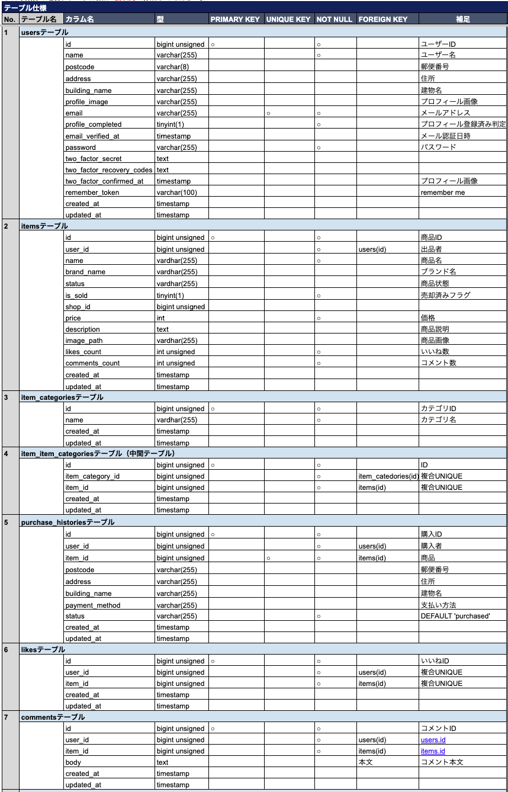
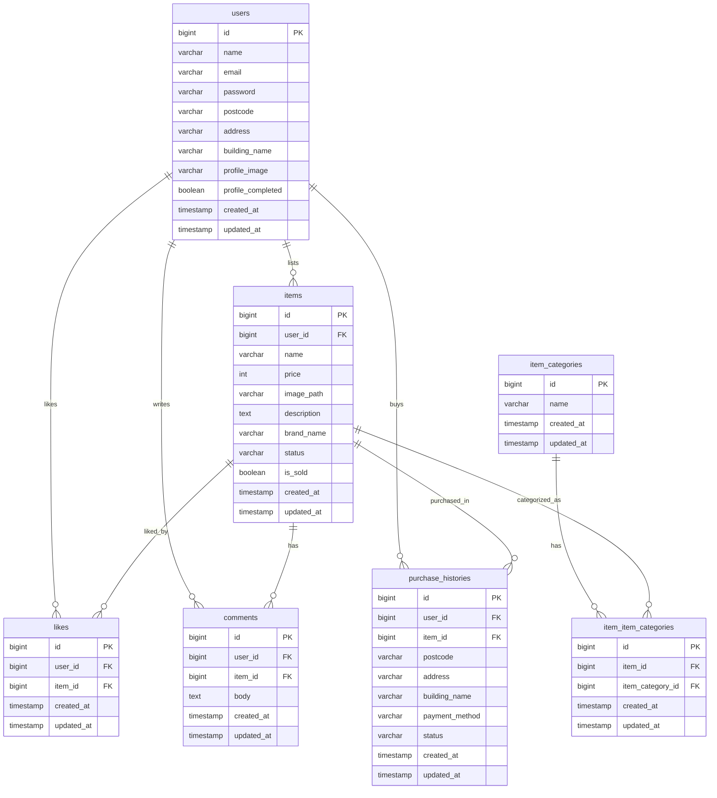

# Coachtech Furima

Laravelを用いたフリマアプリケーションです。  
ユーザー登録・ログイン・商品出品・購入・いいね・コメント機能を実装しています。

---

# 環境構築

## Dockerビルド

1. git clone git@github.com:ArigaAii/coachtech-furima.git
2. cd coachtech-furima
3. DockerDesktopアプリを立ち上げる
4. docker-compose up -d --build

## Laravel環境構築

1. docker-compose exec php bash
2. composer install
3. 「.env.example」ファイルを 「.env」ファイルに命名を変更。または、新しく.envファイルを作成
4. .envに以下の環境変数を追加
```
DB_CONNECTION=mysql
DB_HOST=mysql
DB_PORT=3306
DB_DATABASE=laravel_db
DB_USERNAME=laravel_user
DB_PASSWORD=laravel_pass
```
5. アプリケーションキーの作成

```
php artisan key:generate
```

6. マイグレーションの実行

```
php artisan migrate
```

7. シーディングの実行

```
php artisan db:seed
```

8. シンボリックリンク作成

```
php artisan storage:link
```

# 使用技術(実行環境)

* PHP 8.3
* Laravel 8.x
* MySQL 8.0
* Docker/docker-compose

# テーブル設計



# ER図



# URL
* アプリケーション:http://localhost
* phpMyAdmin:http://localhost:8080

# 補足
### 本アプリは学習目的で作成したフリマアプリです。
## 機能一覧
* ユーザー登録
* ログイン
* 商品出品
* 購入機能
* いいね機能
* コメント機能