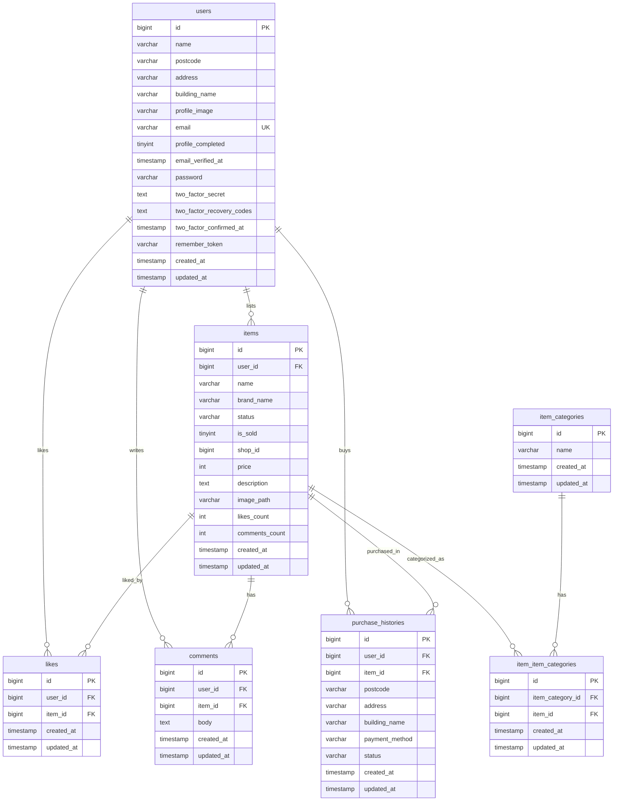

### 制約メモ（DB仕様）
- likes：UNIQUE(user_id, item_id)
- item_item_categories：UNIQUE(item_category_id, item_id)
- 外部キー
  - items.user_id → users.id
  - likes.user_id → users.id / likes.item_id → items.id
  - comments.user_id → users.id / comments.item_id → items.id
  - purchase_histories.user_id → users.id / purchase_histories.item_id → items.id
  - item_item_categories.item_id → items.id / item_item_categories.item_category_id → item_categories.id